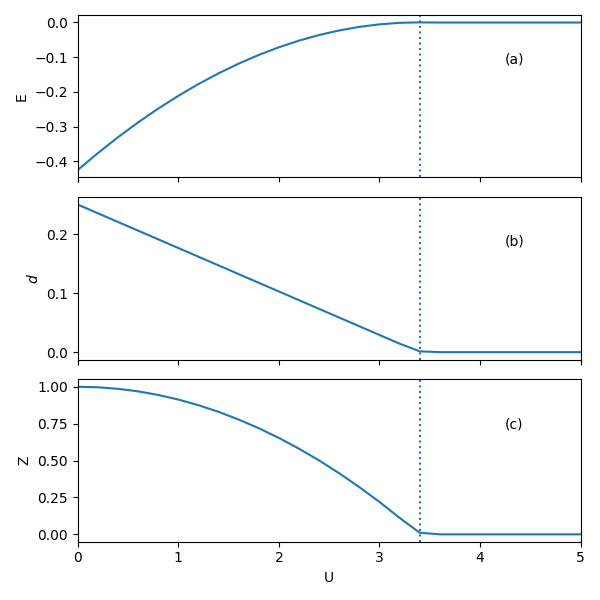

Single-band Bethe lattice
-------------------------

In this example, we study a special one-band Hubbard model, 
which has semi-circular noninteracting density of states (DOS),
It corresponds to Bethe lattice with infinite coordination number.
You will learn:

* How to set up a simple model calculation
* How the correlation strength induces metal-insulator transition 
  in the Gutzwiller-slave-boson theory
* How to determine the energy gap for the Mott-insulating phase

Time for this part: ~20 minutes.

GRISB calculations with increasing `U`
======================================

There is predefined class,
which helps generating the energy mesh with uniform weight.

.. autoclass:: pygrisb.model.special.semicircular
    :members: 

In the model, we use half-band width as the energy unit. 
The noninteracting DOS and cumulative dos is shown as below:

.. image:: _images/semicir_dos.png
    :alt: semicircular dos and cdos
    :scale: 100 %
    :align: center

The half-circle DOS corresponds to single band on the Bethe lattice 
in infinite dimenstion or with infinite coordination number.
A function to setup the model for *CyGutz* calculation 
has been defined,

.. autofunction:: pygrisb.model.semicir.gutz_model_setup
    
The system is set as a grand canonical ensemble,
with the basic control parameters of Hubbard interaction :math:`U`,
which controls the onsite screened Coulomb interaction strength,
and chemical potential :math:`\mu`, 
which controld the electron filling.
For convenience, we have also predefined a function 
to run *CyGutz* for a list of Hubbard :math:`U` 
or chemical potential :math:`\mu`,

.. autofunction:: pygrisb.model.test.scan_semicirc.generate_data

Let us first look at the case of fixed :math:`\mu=0`, 
i.e., in the particle-hole symmetric case. 
We will perform a series of *CyGutz* calculations with increasing :math:`U`,
and check the behavior of the total energy, double occupancy, 
and quasi-particle weight (`Z`=:math:`R^\dagger R`).
Recall that in Gutzwiller-slave boson theory,
Z=0 implies the system is in the Mott insulating phase,
where all the spectral weight becomes non-coherent. 

A script for a job for scanning a list of :math:`U` is defined as

.. autofunction:: pygrisb.model.test.scan_semicirc.scan_u

For a hands-on practice, assuminig your current directory 
is *comrisb_tutorial/tutorials/Bethe_Latt/*, 
type the following command to run the job::

    $ mkdir -p work && cd work && python3.7 ../scan_semicirc.py

It will automatically generate the following results:

The three panels from top to bottom plot the total energy `E`, 
double occupancy `d`, and quasi-particle weight `Z` as `U` increases.
When the system transforms from metallic phase to Mott insulating phase,
the double occupancy and quasi-particle weight vanish, 
and the total energy becomes a constant.
One can see that the :math:`U_{c}` ~ 3.4 for the metal-insulator transition.

.. note::
   This depicts the famous Brinkman-Rice metal-insulator transition picture,
   which neglects high-energy virtual processes 
   and can be regarded as zeroth order description for the Mott phase.
   For recent advancement within the generalized Gutzwiller approach,
   please refer to [Lanata17]_ and [Frank21]_.

GRISB Mott gap revealed by scanning chemical potential
======================================================

Although the theory gives a very simplified picture of the Mott insulator,
i.e., double occupancy or quasi-particle weight is 0, 
it is possible to get the band gap size by varying the chemical potential.

A script for a job of scanning :math:`\mu` at :math:`U=5` is defined as

.. autofunction:: pygrisb.model.test.scan_semicirc.scan_mu

Stay in the same *work* directory 
and type the following command for calculations to get the band gap::

    $ python ../scan_semicirc.py --mu

It will automatically generate the following results:

.. image:: _images/edznmu_u5.png
    :alt: e/d/z/n vs mu
    :scale: 100 %
    :align: center

One can see that the physical quantities of interest stay constant
in the gap region. 
When :math:`\mu` increases over ~ 1.4, 
the orbital occupation :math:`n` starts to decrease,
indicating the gap size ~ 1.4*2 = 2.8. 
The factor of 2 comes from  particle-hole symmetry.

.. [Lanata17] N. Lanata, T.-H. Lee, Y.-X. Yao, and V. Dobrosavljevc, 
    Emergent Bloch Excitations in Mott Matter, Phys. Rev. B 96, 195126 (2017).

.. [Frank21] M. S. Frank, T.-H. Lee, G. Bhattacharyya, P. K. H. Tsang, 
    V. L. Quito, V. Dobrosavljevic, O. Christiansen, and N. Lanata , 
    Quantum-Embedding Description of the Anderson Lattice Model 
    with the Ghost Gutzwiller Approximation, arXiv:2106.05985 (2021).
